

# Proyecto Final Laboratorio de Computación Gráfica E Interacción Humano-Computadora 👨🏽‍💻

## Manual de Usuario: Ambiente virtual 📖

### Semestre 2022-1 | Grupo 9

### Por: Héctor Mauricio García Serrano 🤵🏽

### Requerimentos

* Para ejecución con Visual Studio 2019 con instalación de C++ o con el ejecutable .exe:
    - Windows 7 (Última actualización), Windows 8 (2919355), Windows 10 (version 1703 o superior)
    - Procesador: 1.8 GHz (recomendado 4 núcleos o más)
    - 2.5 GB RAM mínimo, 8 GB recomendado
    - 20 GB en disco, recomendado
    - Chip gráfico de mínimo 720p de resolución

### Apertura y ejecución del proyecto

Descargar el proyecto desde GitHub dando click al boton verde "Code" y seleccionando una de las opciones

    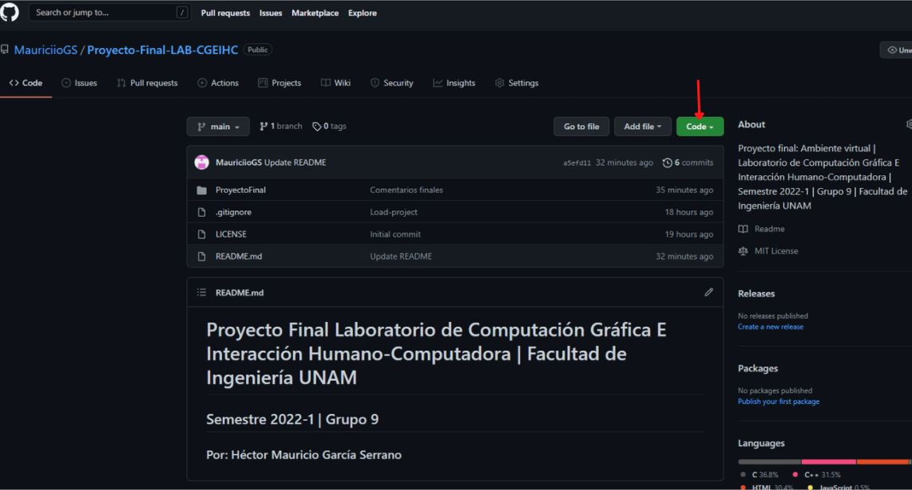</img>
    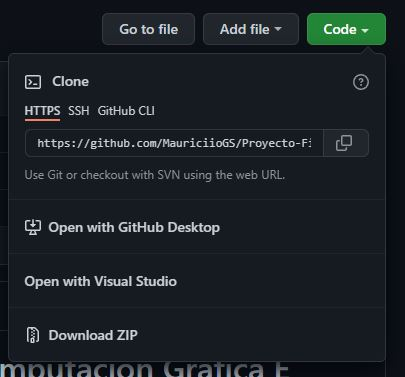</img> 

    Si selecciona "Open with GitHub Desktop" requiere tener esta aplicación instalada en su equipo y seguir los pasos para clonar el repositorio de manera local, una vez clonado saltar hasta "Ejecución el archivo .exe".

    La selección "Download ZIP" descargará un archivo .zip del proyecto, habrá que descomprimirlo en su equipo, regresar a este manual y saltarse hasta "Ejecución el archivo .exe".

    Si selecciona "Open with Visual Studio" se abrirá el proyecto directamente en el IDE dando la opción de "Clonar repositorio", se deberá seleccionar la ruta local para guardar el repositorio y dar click en "Clonar". 

    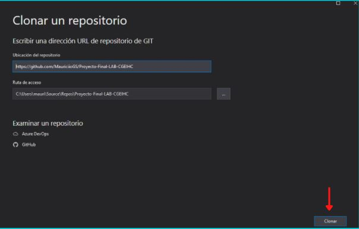</img> 

    Se desplegará una ventana de carga y al finalizar se abrirá el espacio de trabajo de Visual Studio. Localizar la ventana "Explorador de soluciones: Vistas" y dar doble click en la solución "ProyectoFinalsln".

    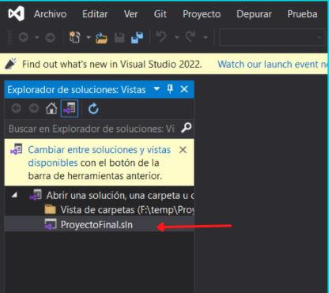</img>

    Si se desea visualizar el archivo .cpp o los .h hay que desplegar la carpeta de la solución dando click en la flechita junto al nombre de la solución como se muestra a continuación.

    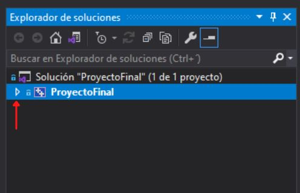</img>
    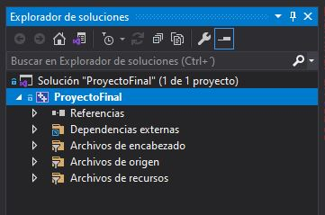</img>

    Para poner en ejecución el proyecto se debe seleccionar la opción "x86" en la barra superior y verificar que esté seleccionada la opción "Debug" como se muestra en la siguiente imagen.

    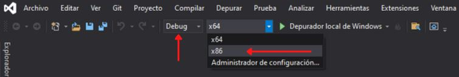</img>

    Ya puede ejecutarse el proyecto dando click en el boton "Depurador local de Windows", esto abrirá la ventana del programa.

    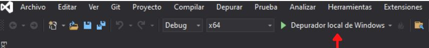</img>

### Ejecución con archivo .exe 🚀

Una vez clonado el proyecto o descomprimido el ZIP: abrir la carpeta generada o ubicación del repositorio en su equipo y dirigirse a ".\ProyectoFinal\ProyectoFinal", ubicar el archivo "ProyectoFinal.exe" y dar doble click para abir. Lo anterior abrirá una ventana con el espacio virtual ejecutandose.

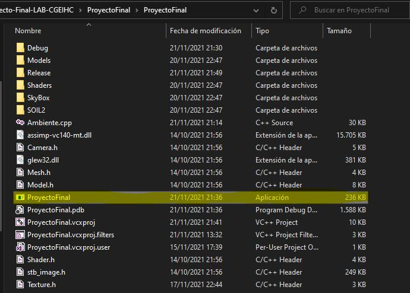</img>

### Interacción con el ambiente ⛺️

Una vez abierta la ventana; estando dentro del espacio virtual se captura el mouse para funcionar unicamente dentro de este, por lo que no se observa el cursos y el movimiento del mouse solo funciona dentro de la ventana. La interacción se da mediante el teclado y mouse de la computadora.

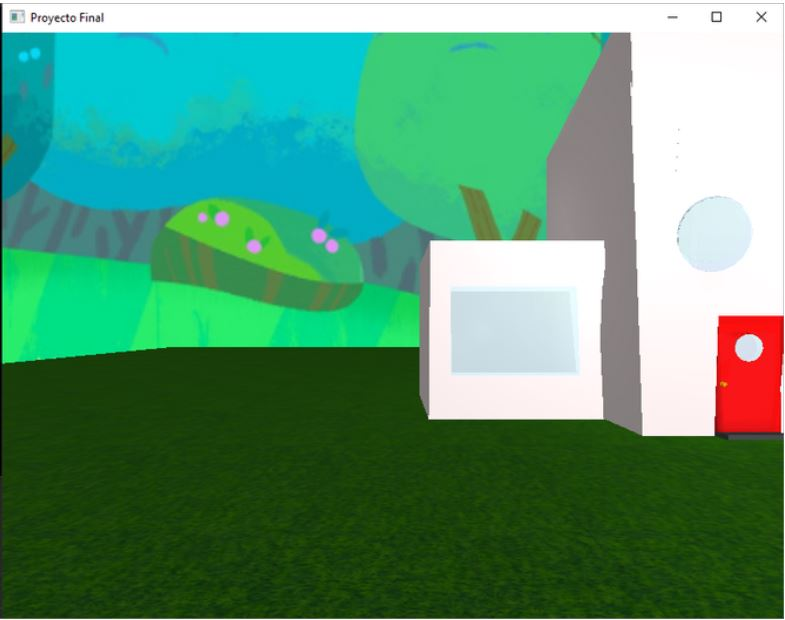</img>

#### Funciones
* Teclado:
    * "Esc" : para salir de la ventana / terminar el programa. ❌
    
    Simulación de las teclas de adelante ⬆️, atrás ⬇️, izquierda ⬅️, derecha ➡️ para movimiento como sucede en los videojuegos
    * "W" : mover la cámara hacia enfrente ⬆️. 
    * "S" : mover la cámara hacia atrás ⬇️. 
    * "A" : mover la cámara hacia la izquierda ⬅️.
    * "D" : mover la cámara hacia la derecha ➡️.
    
    Animaciones:
    * "R" : inicia/reinicia la animación de apertura de la puerta exterior 🚪.
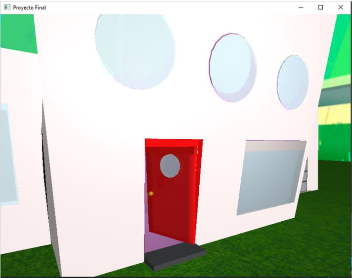</img>
    * "E" : inicia/reinicia la animación de apertura en de la puerta de la     habitación 🚪 junto al cofre 📦 y la caída de los lápices de colores 🖍.
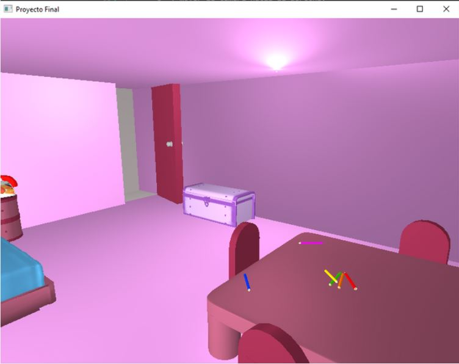</img>

* Movimientos del mouse:
    * El deslizamiento del mouse 🔁 a la izquierda o derecha, arriba o abajo realiza el giro de la cámara 📷 en dicha dirección de deslizado, el field of view 🔍 se mueve como sucede con el cursor de la computadora.

